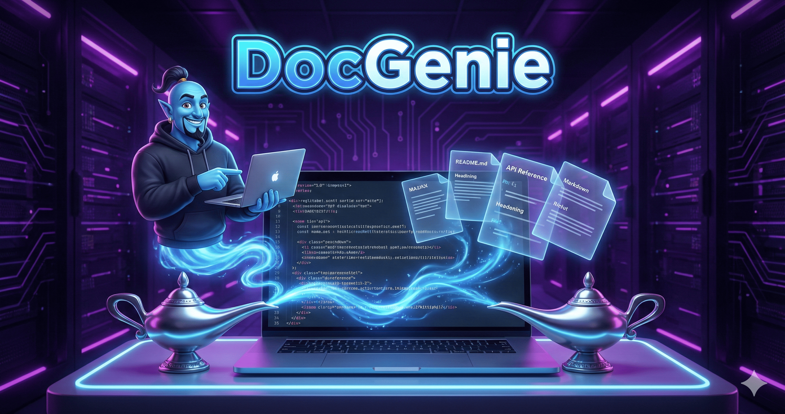
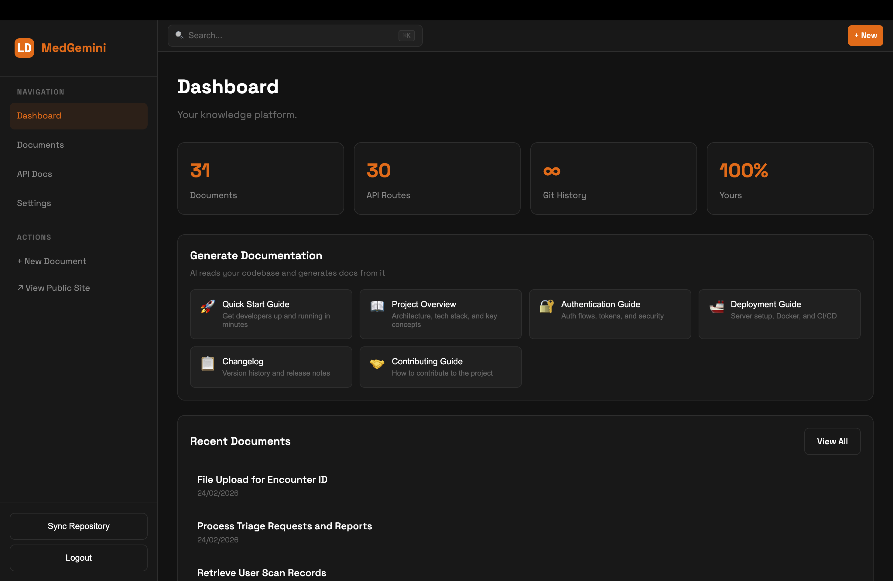
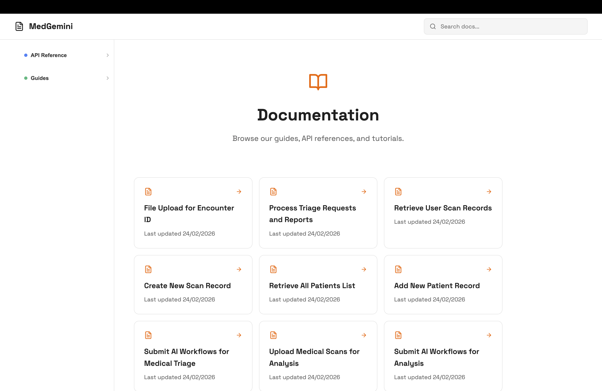

<div align="center">

# 🧞 DocGenie

**AI-Powered Documentation that Writes Itself**

*Stop writing docs. Start shipping code.*



[](https://choosealicense.com/licenses/mit/)
[](https://nodejs.org/)
[](https://openai.com/)

[Features](#-features) • [Quick Start](#-quick-start) • [Architecture](#-architecture) • [Documentation](#-documentation) • [Contributing](#-contributing)

</div>

---

## 📸 Screenshots

### Dashboard Page


### Public Documentation Page


---

## 🎯 The Problem

Developers hate writing documentation. It's tedious, time-consuming, and always seems to fall behind the code. Existing solutions require manual effort or produce generic, unhelpful docs.

## ✨ The Solution

**DocGenie** uses AI to automatically generate, update, and organize your documentation by analyzing your actual codebase. It understands your API routes, extracts meaningful descriptions, and creates beautiful, searchable documentation — all without you writing a single line of docs.

### 💰 Cost-Effective AI

We tested DocGenie on a production codebase with **31 API routes**. The total cost? **Less than $0.20** using GPT-4o. That's less than a cent per endpoint for comprehensive, accurate documentation.

---

## 🚀 Features

### 🤖 AI-Powered Documentation Generation
- **Auto-detects API routes** from Express.js, Fastify, NestJS, and more
- **Extracts parameters, responses, and descriptions** from your actual code
- **Generates OpenAPI-compatible documentation** automatically
- **Creates quick-start guides** based on your actual codebase

### 🧠 Smart Categorization
- **AI categorizes documents** into API, Guides, Reference, Architecture, etc.
- **Sub-categorization** groups related endpoints (e.g., all user endpoints together)
- **Automatic organization** — no manual tagging required

### 🔍 Semantic Search
- **Natural language search** powered by OpenAI embeddings
- "How do I create a user?" finds the relevant API docs instantly
- **Vector-based similarity** for accurate results

### 📝 Markdown + Wiki Links
- Write docs in Markdown with **[[wiki-style]]** linking
- **Bidirectional links** automatically tracked
- **Frontmatter support** for metadata

### 🎨 Beautiful UI
- **Clean, modern documentation site** — zero configuration
- **Dark/Light themes** 
- **Responsive design** for all devices
- **Searchable, navigable** documentation

### 🔌 Easy Integration
- **Drop-in setup** for any Node.js project
- **File watcher** for real-time doc updates
- **Git integration** for version tracking

---

## 🏗 Architecture

```
┌─────────────────────────────────────────────────────────────────┐
│                         DocGenie                                 │
├─────────────────────────────────────────────────────────────────┤
│                                                                  │
│  ┌──────────────┐    ┌──────────────┐    ┌──────────────┐      │
│  │   Frontend   │    │   Backend    │    │   AI Layer   │      │
│  │   (React)    │◄──►│  (Express)   │◄──►│  (OpenAI)    │      │
│  └──────────────┘    └──────────────┘    └──────────────┘      │
│         │                   │                   │               │
│         │           ┌───────┴───────┐           │               │
│         │           │               │           │               │
│         │    ┌──────▼──────┐ ┌──────▼──────┐    │               │
│         │    │   SQLite    │ │  File Watcher│   │               │
│         │    │  (WAL mode) │ │  (Chokidar)  │   │               │
│         │    └─────────────┘ └─────────────┘    │               │
│         │                                       │               │
│         │           ┌───────────────────────────┘               │
│         │           │                                           │
│  ┌──────▼───────────▼──────────────────────────────────────┐   │
│  │                    Your Codebase                          │   │
│  │  ┌─────────────┐  ┌─────────────┐  ┌─────────────┐       │   │
│  │  │  API Routes │  │   Markdown  │  │   Config    │       │   │
│  │  │  (JS/TS)    │  │    Docs     │  │   Files     │       │   │
│  │  └─────────────┘  └─────────────┘  └─────────────┘       │   │
│  └──────────────────────────────────────────────────────────┘   │
│                                                                  │
└─────────────────────────────────────────────────────────────────┘
```

### How It Works

1. **Code Scanning**: DocGenie watches your codebase for API routes and markdown files
2. **AI Analysis**: When changes are detected, AI analyzes the code and generates documentation
3. **Smart Organization**: Documents are automatically categorized and linked
4. **Instant Search**: Embeddings enable semantic search across all documentation
5. **Beautiful Output**: A clean documentation site is served instantly

---

## ⚡ Quick Start

### Prerequisites

- Node.js 18+ or Bun
- OpenAI API key

### Installation

```bash
# Clone the repository
git clone https://github.com/mry0tt4/DocGenie.git
cd DocGenie

# Install dependencies
bun install

# Set up environment
cp backend/.env.example backend/.env
# Add your OPENAI_API_KEY to backend/.env

# Start the development servers
bun dev
```

### Configuration

Edit `backend/.env`:

```env
# Required: Your OpenAI API key
OPENAI_API_KEY=sk-...

# Optional: Path to your documentation (default: ./docs)
REPO_PATH=./docs

# Optional: Path to your API code for auto-detection
PROJECT_CODE_PATH=./src

# Server port
PORT=3001
```

### Creating Your First Docs

1. Add markdown files to your `docs/` folder
2. DocGenie automatically syncs and categorizes them
3. View your docs at `http://localhost:5173`

### Auto-Generating API Docs

1. Set `PROJECT_CODE_PATH` to your API source code
2. Enable API documentation in settings
3. DocGenie scans your routes and generates documentation automatically

---

## 📚 Documentation

### AI Features

#### 🤖 Auto-Documentation Generation
DocGenie analyzes your API routes and generates comprehensive documentation including:
- HTTP methods and endpoints
- Request/response schemas
- Path and query parameters
- Authentication requirements
- Example requests

#### 🧠 Smart Categorization
Documents are automatically categorized into:
- **API Reference** - Endpoint documentation
- **Guides** - Tutorials and how-tos
- **Reference** - Configuration and schemas
- **Architecture** - System design docs
- **Changelog** - Version history

#### 🔍 Semantic Search
Powered by OpenAI embeddings, search understands context:
- "How do I authenticate?" → Finds auth-related docs
- "Create a new user" → Finds user creation endpoints

### Wiki-Style Linking

Link documents using `[[wiki-style]]` links:

```markdown
Check out the [[API Reference]] for more details.
See [[User Management]] for user-related endpoints.
```

### Frontmatter Support

Add metadata to your markdown files:

```markdown
---
title: My Document
category: guide
tags: [tutorial, getting-started]
---

# My Document
...
```

---

## 🛠 Tech Stack

| Component | Technology |
|-----------|------------|
| Frontend | React, Vite, Lucide Icons |
| Backend | Express.js, SQLite (WAL) |
| AI | OpenAI GPT-4o, text-embedding-3-small |
| File Watching | Chokidar |
| Markdown | marked, gray-matter |

---

## 📊 Cost Analysis

Real-world testing on a production codebase:

| Metric | Value |
|--------|-------|
| API Routes Documented | 31 |
| Total Tokens Used | ~50,000 |
| Total Cost (GPT-4o) | **$0.18** |
| Cost per Endpoint | **$0.006** |

*Costs may vary based on code complexity and documentation depth.*

---

## 🤝 Contributing

Contributions are welcome! Please feel free to submit a Pull Request.

1. Fork the repository
2. Create your feature branch (`git checkout -b feature/AmazingFeature`)
3. Commit your changes (`git commit -m 'Add some AmazingFeature'`)
4. Push to the branch (`git push origin feature/AmazingFeature`)
5. Open a Pull Request

---

## 📝 License

This project is licensed under the MIT License - see the [LICENSE](LICENSE) file for details.

---

## 🙏 Acknowledgments

- OpenAI for GPT-4o and embedding models
- The open-source community for inspiration and tools

---

<div align="center">

**Made with ❤️ for developers who hate writing docs**

[⬆ Back to Top](#-docgenie)

</div>
